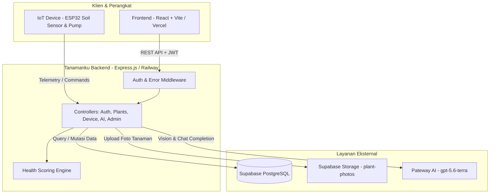
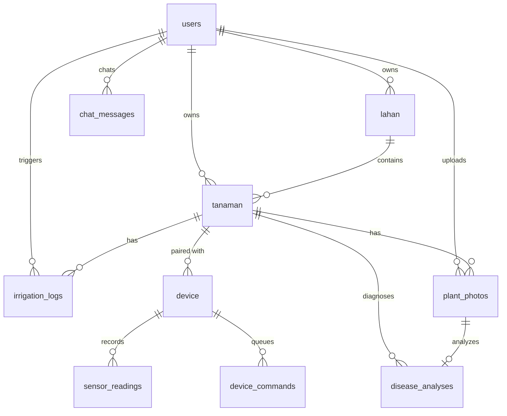
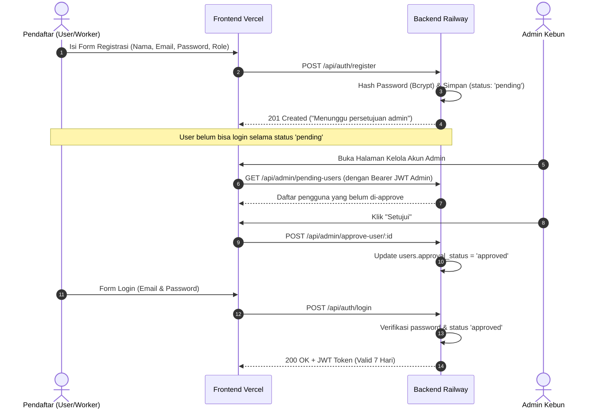
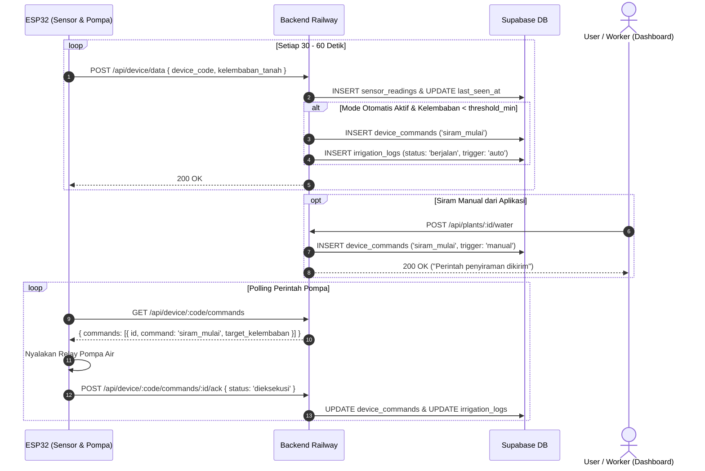
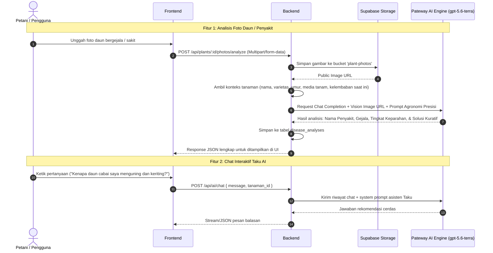

# 🌿 Dokumentasi Backend Tanamanku API

Dokumentasi arsitektur, alur kerja sistem, skema database, dan referensi API untuk **Tanamanku Backend**.

---

## 📌 Daftar Isi
1. [Ringkasan Sistem](#1-ringkasan-sistem)
2. [Arsitektur & Tech Stack](#2-arsitektur--tech-stack)
3. [Skema Database & Relasi Tabel](#3-skema-database--relasi-tabel)
4. [Alur Kerja Sistem (System Flows)](#4-alur-kerja-sistem-system-flows)
   - [4.1 Alur Autentikasi & Approval Akun](#41-alur-autentikasi--approval-akun)
   - [4.2 Alur Telemetri IoT & Smart Irrigation (ESP32)](#42-alur-telemetri-iot--smart-irrigation-esp32)
   - [4.3 Alur Algoritma Kesehatan Tanaman (Health Scoring Engine)](#43-alur-algoritma-kesehatan-tanaman-health-scoring-engine)
   - [4.4 Alur AI Diagnosis & Taku AI Assistant](#44-alur-ai-diagnosis--taku-ai-assistant)
5. [Daftar Lengkap REST API Endpoints](#5-daftar-lengkap-rest-api-endpoints)
6. [Struktur Folder & Kode](#6-struktur-folder--kode)
7. [Environment Variables & Deployment](#7-environment-variables--deployment)

---

## 1. Ringkasan Sistem

**Tanamanku** adalah platform cerdas untuk pemantauan perkebunan/tanaman berbasis Internet of Things (IoT) dan Artificial Intelligence (AI).

Backend bertindak sebagai pusat pengendali yang:
- Menerima data telemetri kelembaban tanah secara berkala dari mikrokontroler (ESP32).
- Menentukan keputusan penyiraman otomatis (*smart auto-watering*) berdasarkan ambang batas (*threshold*) per tanaman.
- Mengirimkan instruksi/command penyiraman ke perangkat aktuator/pompa.
- Menganalisis kondisi tanaman menggunakan Vision AI (Pateway AI) untuk mendeteksi penyakit daun dan kekurangan nutrisi.
- Menyediakan asisten agronomis virtual interaktif (**Taku AI**) untuk menjawab pertanyaan seputar kebun.
- Menyediakan otentikasi multi-peran (*User*, *Worker*, *Admin*) dengan mekanisme persetujuan akun (*account approval workflow*).

---

## 2. Arsitektur & Tech Stack



| Komponen | Teknologi | Keterangan |
|---|---|---|
| **Runtime** | Node.js (v20+) | Lingkungan eksekusi asynchronous event-driven |
| **Web Framework** | Express.js | Router API, middleware handling, CORS |
| **Database** | Supabase (PostgreSQL) | Database relasional dengan extension pgcrypto UUID |
| **File Storage** | Supabase Storage / Local Disk | Penyimpanan foto tanaman dan foto analisis daun |
| **Authentication** | JWT (`jsonwebtoken`) + `bcryptjs` | Stateless session token valid 7 hari |
| **AI Engine** | Pateway AI (`gpt-5.6-terra`) | Vision diagnosis tanaman & LLM chat asisten agronomis |
| **Hosting Production** | Railway | Kontainer otomatis terhubung ke branch `main` GitHub |

---

## 3. Skema Database & Relasi Tabel

Database menggunakan PostgreSQL pada platform Supabase dengan tabel-tabel utama:



### Rincian Tabel:

1. **`users`**:
   - `id` (UUID PK), `nama`, `email`, `password_hash`, `telepon`
   - `role`: `'user' | 'worker' | 'admin'`
   - `approval_status`: `'pending' | 'approved' | 'rejected'`
   - `notif_watering`, `notif_device`, `notif_report` (pengaturan notifikasi)
2. **`lahan`**:
   - `id` (UUID PK), `user_id` (FK), `nama_lahan`, `lokasi`, `luas`
3. **`tanaman`**:
   - `id` (UUID PK), `user_id` (FK), `lahan_id` (FK), `nama`, `jenis_tanaman`, `emoji`
   - `threshold_min` (default: 50%), `threshold_max` (default: 80%)
   - `auto_water_mode` (boolean penyiraman otomatis)
   - `varietas`, `fase_pertumbuhan`, `media_tanam`, `lokasi_blok`, `catatan` (metadata presisi)
   - `status`: `'aktif' | 'nonaktif'`
4. **`device`**:
   - `id` (UUID PK), `tanaman_id` (FK 1-to-1), `device_code` (unik), `tipe_device` (ESP32)
   - `status_koneksi`: `'aktif' | 'perlu_dicek'`
   - `last_seen_at`, `battery_level`
5. **`sensor_readings`**:
   - `id` (BigSerial PK), `device_id` (FK), `kelembaban_tanah`, `recorded_at`
6. **`irrigation_logs`**:
   - `id` (UUID PK), `tanaman_id` (FK), `device_id` (FK)
   - `trigger_type`: `'auto' | 'manual'`
   - `waktu_mulai`, `waktu_selesai`, `durasi_detik`
   - `kelembaban_awal`, `kelembaban_akhir`
   - `status`: `'berjalan' | 'selesai' | 'gagal'`
7. **`device_commands`**:
   - `id` (UUID PK), `device_id` (FK), `command`: `'siram_mulai' | 'siram_stop'`
   - `target_kelembaban`, `status`: `'pending' | 'terkirim' | 'dieksekusi' | 'gagal'`
8. **`plant_photos`**:
   - `id` (UUID PK), `tanaman_id` (FK), `photo_url`, `is_analysis_photo`, `catatan`
9. **`disease_analyses`**:
   - `id` (UUID PK), `tanaman_id` (FK), `photo_id` (FK)
   - `hasil_analisis` (teks diagnosis, saran tindakan, pestisida/nutrisi)
   - `status`: `'sehat' | 'perlu_perhatian' | 'terindikasi_penyakit'`
10. **`chat_messages`**:
    - `id` (UUID PK), `user_id` (FK), `tanaman_id` (FK nullable), `role`: `'user' | 'assistant'`, `content`

---

## 4. Alur Kerja Sistem (System Flows)

### 4.1 Alur Autentikasi & Approval Akun

Untuk menjaga keamanan sistem perkebunan, pendaftaran akun baru melalui tahap verifikasi admin:



---

### 4.2 Alur Telemetri IoT & Smart Irrigation (ESP32)

Perangkat ESP32 membaca sensor kelembaban kapasitif tanah dan berkomunikasi melalui polling HTTP:



---

### 4.3 Alur Algoritma Kesehatan Tanaman (Health Scoring Engine)

Backend memiliki engine kalkulasi mandiri pada `src/services/plantConditionService.js`:

1. **Skor Kelembaban Deviasi (0 - 100)**:
   - Jika kelembaban di bawah `threshold_min`: Skor berkurang dengan formula penalti kekeringan:
     $$\text{Score} = \max(10, 100 - (\text{gap\_min} \times 3.2))$$
   - Jika kelembaban di atas `threshold_max`: Skor berkurang dengan penalti tanah tergenang/becek:
     $$\text{Score} = \max(10, 100 - (\text{gap\_max} \times 2.5))$$
   - Jika berada dalam rentang ideal `[threshold_min, threshold_max]`: Skor bernilai $80 - 100$ tergantung seberapa dekat dengan nilai tengah optimal.
2. **Kategori Status**:
   - **Kritis / Sakit** (`kritis`, merah): Skor $< 40$
   - **Perlu Perhatian** (`perlu_perhatian`, kuning): Skor $40 - 69$
   - **Sehat** (`sehat`, hijau): Skor $\ge 70$
3. **Garden Health Index**:
   Rata-rata tertimbang dari seluruh tanaman aktif yang memiliki pembacaan sensor aktif untuk memberikan ringkasan status satu kebun secara komprehensif di dashboard.

---

### 4.4 Alur AI Diagnosis & Taku AI Assistant



---

## 5. Daftar Lengkap REST API Endpoints

Semua endpoint berawalan `/api` dan sebagian besar memerlukan header `Authorization: Bearer <JWT_TOKEN>`.

### 🔐 Autentikasi (`/api/auth`)
| Method | Endpoint | Auth | Deskripsi |
|---|---|---|---|
| `POST` | `/api/auth/register` | Publik | Registrasi akun baru (status default: `pending`) |
| `POST` | `/api/auth/login` | Publik | Login dengan email & kata sandi |
| `GET` | `/api/auth/me` | User | Mengambil data sesi pengguna saat ini |
| `POST` | `/api/auth/forgot-password` | Publik | Pengajuan reset kata sandi |

### 🌱 Manajemen Tanaman (`/api/plants`)
| Method | Endpoint | Auth | Deskripsi |
|---|---|---|---|
| `GET` | `/api/plants` | User | Daftar seluruh tanaman milik pengguna beserta status sensor & skor kesehatan |
| `POST` | `/api/plants` | User | Tambah tanaman baru (termasuk pairing `device_code` opsional) |
| `GET` | `/api/plants/:id` | User | Detail lengkap satu tanaman, riwayat sensor, dan telemetri |
| `PUT` | `/api/plants/:id` | User | Perbarui data tanaman, threshold kelembaban, atau metadata agronomis |
| `DELETE` | `/api/plants/:id` | User | Hapus tanaman dari kebun |
| `POST` | `/api/plants/:id/water` | User | Mulai penyiraman manual |
| `POST` | `/api/plants/:id/stop-water` | User | Hentikan penyiraman manual |
| `GET` | `/api/plants/:id/photos` | User | Riwayat galeri foto tanaman |
| `POST` | `/api/plants/:id/photos` | User | Unggah foto dokumentasi biasa |

### 🤖 Kecerdasan Buatan / Taku AI (`/api/ai`)
| Method | Endpoint | Auth | Deskripsi |
|---|---|---|---|
| `POST` | `/api/plants/:id/photos/analyze` | User | Unggah foto daun tanaman untuk didiagnosis penyakit oleh AI Vision |
| `POST` | `/api/ai/chat` | User | Kirim pesan chat konsultasi ke asisten Taku AI |
| `GET` | `/api/ai/chat/history` | User | Mengambil riwayat percakapan Taku AI |
| `GET` | `/api/ai/analytics` | User | Rekomendasi analitik kebun, efisiensi air, dan tren kelembaban |

### 📡 IoT Device Bridge (`/api/device`)
| Method | Endpoint | Auth | Deskripsi |
|---|---|---|---|
| `POST` | `/api/device/data` | Device/ESP | Kirim data pembacaan sensor kelembaban `{ device_code, kelembaban_tanah }` |
| `GET` | `/api/device/:code/commands` | Device/ESP | Ambil antrian instruksi penyiraman (*pending commands*) untuk ESP32 |
| `POST` | `/api/device/:code/commands/:id/ack` | Device/ESP | Konfirmasi bahwa ESP32 selesai mengeksekusi instruksi penyiraman |

### 📊 Riwayat & Log (`/api/history`)
| Method | Endpoint | Auth | Deskripsi |
|---|---|---|---|
| `GET` | `/api/history` | User | Log terpadu riwayat penyiraman dan catatan foto tanaman |
| `GET` | `/api/history/watering` | User | Daftar khusus log riwayat penyiraman (durasi, kelembaban awal/akhir) |
| `GET` | `/api/history/photos` | User | Daftar seluruh galeri foto tanaman |

### 🛡️ Admin Panel (`/api/admin`)
| Method | Endpoint | Auth | Deskripsi |
|---|---|---|---|
| `GET` | `/api/admin/pending-users` | Admin | Daftar pengguna baru yang menunggu persetujuan (*pending approval*) |
| `POST` | `/api/admin/approve-user/:id` | Admin | Setujui akun pengguna agar bisa login |
| `POST` | `/api/admin/reject-user/:id` | Admin | Tolak akun pendaftar |
| `GET` | `/api/admin/users` | Admin | Kelola daftar seluruh pengguna di sistem |

---

## 6. Struktur Folder & Kode

```text
tanamanku-backend/
├── src/
│   ├── controllers/            # Logic pengendali request & response
│   │   ├── adminController.js
│   │   ├── aiController.js       # AI Vision diagnosis & Taku chat
│   │   ├── analyticsController.js
│   │   ├── authController.js     # Registrasi, login, & token JWT
│   │   ├── deviceController.js   # Ingestion sensor IoT & command queue
│   │   ├── historyController.js
│   │   ├── plantsController.js   # CRUD tanaman & aktuasi pompa
│   │   ├── profileController.js
│   │   └── usersController.js
│   ├── middleware/             # Middleware otentikasi & proteksi
│   │   ├── auth.js               # Verifikasi token JWT & permission check
│   │   └── errorHandler.js       # Centralized response formatter jika terjadi error
│   ├── migrations/             # Skrip SQL skema & migrasi Supabase
│   │   ├── 001_init.sql
│   │   ├── 002_role_approval.sql
│   │   ├── 003_ai_features.sql
│   │   └── 004_plant_metadata.sql
│   ├── routes/                 # Peta routing endpoint Express
│   │   ├── admin.js
│   │   ├── ai.js
│   │   ├── auth.js
│   │   ├── device.js
│   │   ├── history.js
│   │   ├── plants.js
│   │   ├── profile.js
│   │   └── users.js
│   ├── services/               # Reusable business logic
│   │   ├── plantConditionService.js # Health score & classification engine
│   │   └── statusService.js
│   ├── db.js                   # Inisialisasi Supabase Client (Service Role)
│   └── index.js                # Entry point server Express & konfigurasi CORS
├── seed-accounts.js            # Script generator akun default admin & worker
├── .env.example                # Template konfigurasi environment variable
├── package.json
└── backend.md                  # Dokumentasi teknis sistem
```

---

## 7. Environment Variables & Deployment

### Daftar Konfigurasi Environment:
```env
# Koneksi Database Supabase
SUPABASE_URL=https://xxxxxxxxxxxx.supabase.co
SUPABASE_SECRET_KEY=sb_secret_xxxxxxxxxxxxxxxxxxxxxxxxxx
SUPABASE_STORAGE_BUCKET=plant-photos

# Keamanan Token JWT
JWT_SECRET=rahasia_string_acak_minimal_32_karakter

# Server & Port
PORT=3001
FRONTEND_URL=https://tanamanku-weld.vercel.app
SUPPORT_PHONE=6285215002047

# AI Engine (Pateway AI / OpenAI Compatible)
PATEWAY_API_KEY=sk-ptw-xxxxxxxxxxxxxxxxxxxx
PATEWAY_MODEL=gpt-5.6-terra
PATEWAY_BASE_URL=https://api.pateway.ai/v1
```

### Prosedur Deployment di Railway:
1. Pastikan repository backend terhubung ke project Railway.
2. Tambahkan seluruh environment variable di atas melalui menu **Variables** di Railway Dashboard.
3. Pastikan `FRONTEND_URL` diisi dengan domain frontend Vercel untuk mengizinkan CORS.
4. Di sisi frontend Vercel, atur `VITE_API_URL` mengarah ke URL publik Railway backend dengan akhiran `/api` (contoh: `https://amat-production.up.railway.app/api`).
